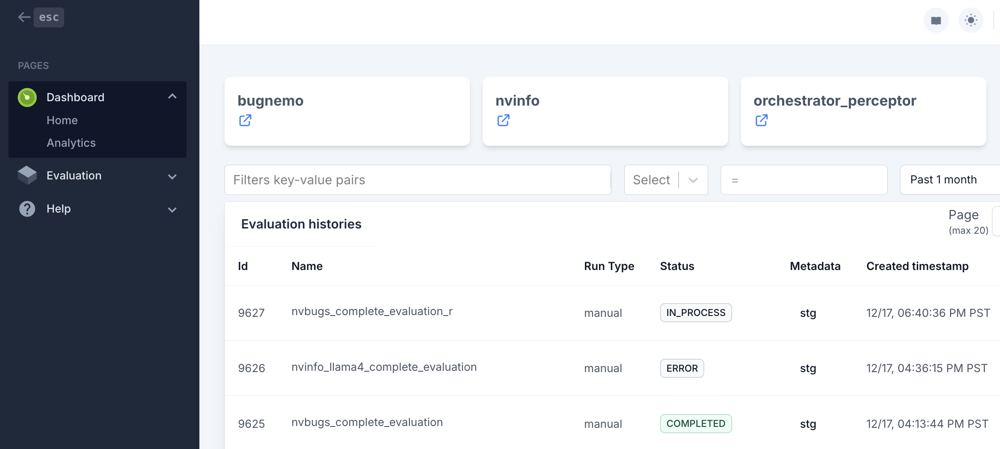
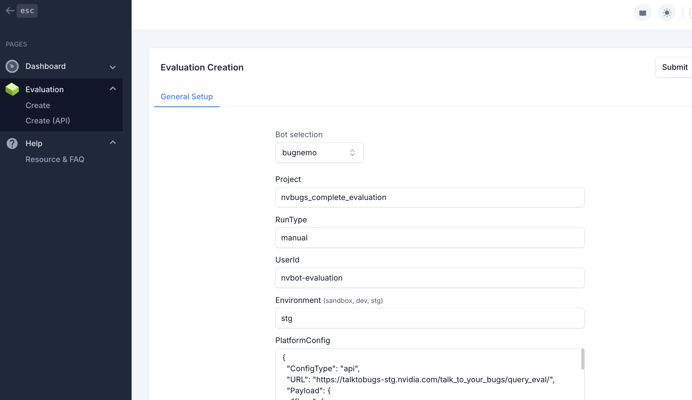
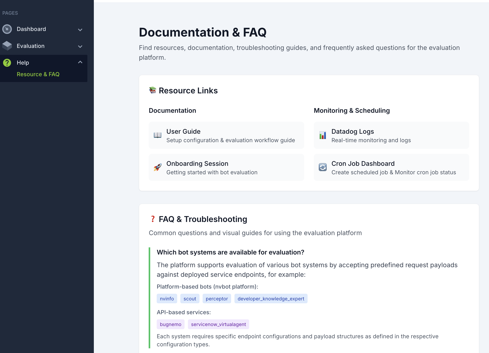

# Evaluation UI

A comprehensive web application for managing, monitoring, and analyzing AI bot evaluation workflows. This platform provides an intuitive interface for creating evaluation runs, tracking performance metrics, and generating detailed analytics reports.

## 🚀 Key Features

### 📊 Evaluation Management
- **Multi-Bot Support**: Evaluate various bot systems including platform-based (nvinfo, scout, perceptor) and API-based (bugnemo, servicenow_virtualagent) configurations
- **Flexible Run Types**: Support for manual triggers, scheduled cron jobs, and legacy evaluation workflows
- **Environment Management**: Test across multiple environments (sandbox, dev, stg, prd)
- **Custom Dataset Integration**: Upload and manage evaluation datasets with S3 storage backend

### 📈 Analytics & Monitoring
- **Comprehensive Analytics Dashboard**: Visual comparison of evaluation runs with accuracy, latency, and success metrics
- **Historical Performance Tracking**: Browse and filter evaluation history with advanced pagination
- **Real-time Monitoring**: Integration with Datadog for live metrics and alerting
- **Export Capabilities**: Download results to Excel for detailed analysis

### 🔧 Advanced Configuration
- **Dynamic System Selection**: Automatically loads available bot configurations from API endpoints
- **Customizable Payloads**: Support for both platform-based and API-based configuration structures
- **Rich Tag Support**: Comprehensive tagging system for filtering and monitoring (history-id, eval-id, project-name, bot-name, dataset-id, environment, model, creation_time)

## 📸 Screenshots

### Main Dashboard

*The main dashboard provides an overview of recent evaluation runs with filtering and search capabilities*

### Evaluation Creation

*Intuitive form interface for creating new evaluation runs with bot selection, environment configuration, and dataset options*

### Help & Documentation

*Comprehensive FAQ and resource center with visual guides, troubleshooting steps, and monitoring tools*

## 🏗️ Architecture

The application follows a modern React/Next.js architecture with:
- **Frontend**: Next.js with TypeScript, Tailwind CSS, and Tremor UI components
- **State Management**: React Context API and custom hooks
- **API Integration**: Custom fetch hooks with comprehensive error handling
- **Authentication**: Token-based authentication with session management
- **Monitoring**: Datadog integration for metrics and logging

## 🛠️ Getting Started

### Prerequisites
- Node.js 16+ 
- npm or yarn
- Access to evaluation service endpoints

### Installation

1. **Clone Repository**
```bash
git clone <repository-url>
cd langchain-eval-ui
```

2. **Install Dependencies**
```bash
npm install
```

3. **Environment Configuration**
Configure your environment variables and endpoint settings in the appropriate configuration files.

4. **Run Development Server**
```bash
npm run dev
```

The application will be available at `http://localhost:3000`

## 🔗 API Endpoints

### Development & Staging Environment
```
Token: rdlDOBYASPqgModybRvSuQYn_aamo_2kkdEcsQccQ9M
```

### Production Environment  
```
Token: e5m5NwmeXpHiqDkeQIhFfjAUZNvejcKZK-AC9C7Vjcs
```

## 🐳 Docker Deployment

### Build Image
```bash
docker build --build-arg "REGISTRY_TOKEN=$REGISTRY_TOKEN" --build-arg "CONFIG_ENV=dev" . -t eva-ui
```

### Run Container
```bash
docker run eva-ui:latest
```

## 📋 Usage Guide

### Creating an Evaluation Run
1. Navigate to **Evaluation** → **Create** from the sidebar
2. Select your bot system from the dropdown
3. Configure environment settings (sandbox, dev, stg, prd)
4. Optionally specify custom dataset parameters
5. Click **Submit** to start the evaluation

### Viewing Analytics
1. Go to **Dashboard** → **Analytics**
2. Use filters to narrow down specific runs
3. Select multiple runs for comparison
4. Export results to Excel for detailed analysis

### Monitoring & Troubleshooting
1. Visit **Help** → **Resource & FAQ** for comprehensive guides
2. Access Datadog logs for real-time monitoring
3. Use the search functionality to find specific evaluation runs
4. Follow the visual troubleshooting guides for common issues

## 🆕 Latest Updates

### Resource & FAQ Enhancement
We're thrilled to share the latest Evaluator's update featuring a comprehensive Resource & FAQ section. Our goal is to empower customers to resolve issues independently and enhance productivity.

**🌟 What's New**
Navigate to: **Help** → **Resource & FAQ**

1. **Resource Links**: Centralized documentation, monitoring, and scheduling links for easier access
2. **FAQ Section**: Comprehensive coverage of:
   - Supported evaluation types and configurations
   - Run details and troubleshooting guides
   - Analytics page functionality
   - Datadog dashboard creation
   - Visual step-by-step guides with screenshots

## 🤝 Support

For technical support or questions:
- Check the **Help** → **Resource & FAQ** section
- Review Datadog logs for system status
- Contact the development team
- Refer to the comprehensive onboarding documentation

## 🏆 Credits

Special thanks to the amazing development team: **Aaditya Shukla** and **Tony Salim** for their outstanding contributions to this platform! 🎉

---

*This platform streamlines AI bot evaluation workflows, providing teams with the tools needed to monitor, analyze, and improve bot performance across multiple environments and configurations.*